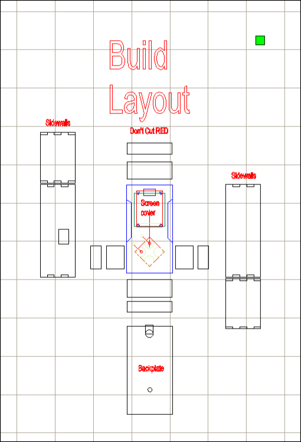

## Ryhmätyö Elektroniikan Perusteet 2 -kurssille

Tekijät:

- Oskari Ekholm

- Teemu Hiltunen

- Mikko Jutila

Aloitus:

24.02.2025

Valmis:

01.04.2025

### Kuvaus

Ideana luoda yksinkertainen pelikonsoli Arduino Nanoa hyödyntäen (ATMega 328p). Peliksi valittiin klassinen käärmepeli tai matopeli, missä pelaaja kerää hedelmiä ja siten kasvattaa pituutta. Peliin lisättiin myös kivi, johon törmäämällä peli päättyy. Pelaaja voi myös halutessaan lisätä haastetta peliin vaihtamalla vaikeusasteen vaikealle, jossa liikkumisnappien järjestys arvotaan.

Projektiin kuului myös koteloinnin valmistus, ja päätimme käyttää laserleikkuria 3D-tulostimen sijaan nopeuttamaan kehitystä, lyhentämällä iteraatioiden välistä aikaa.

Oheisessa kuvassa näkyy eri osat räjäytettynä tasolle, joka helpottaa hahmottamaan kuinka laatikko muodostuu. 
Laatikko valmistettiin Jamie Hyneman Centerillä LUT:illa ja siihen käytettiin Bodor BCL-1309XU laserleikkuria.

