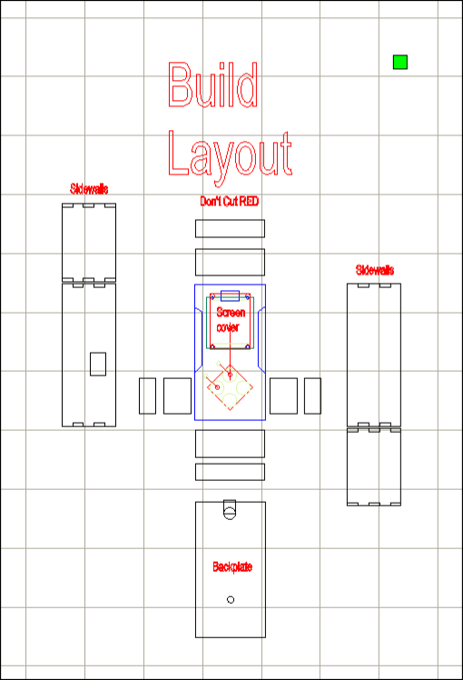
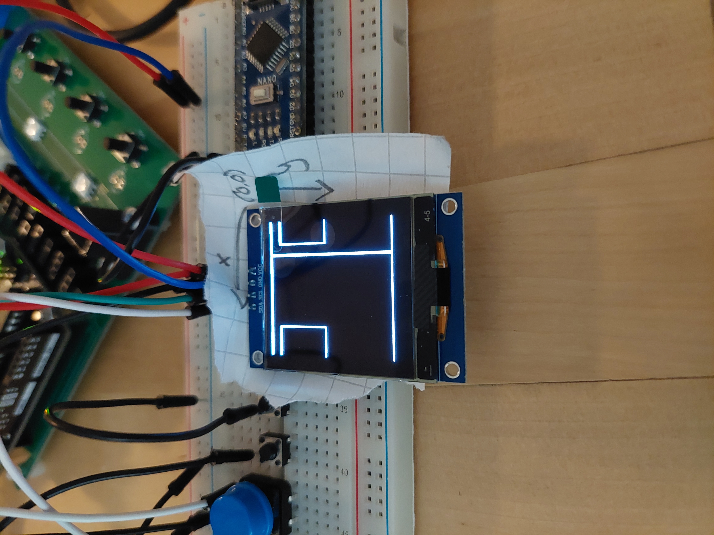
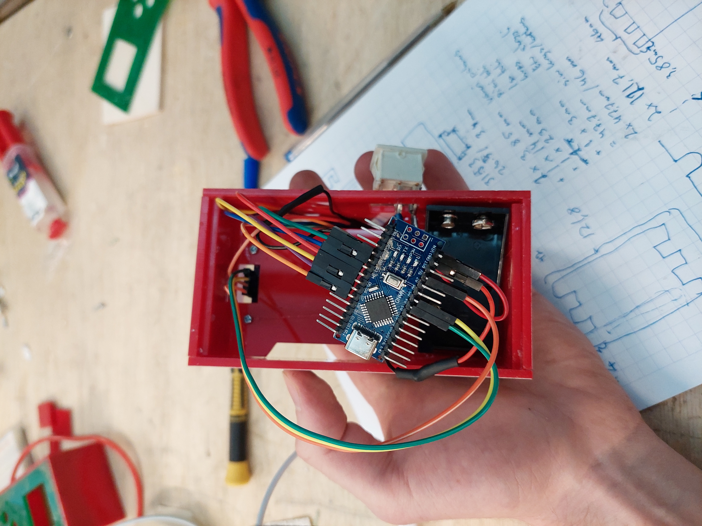
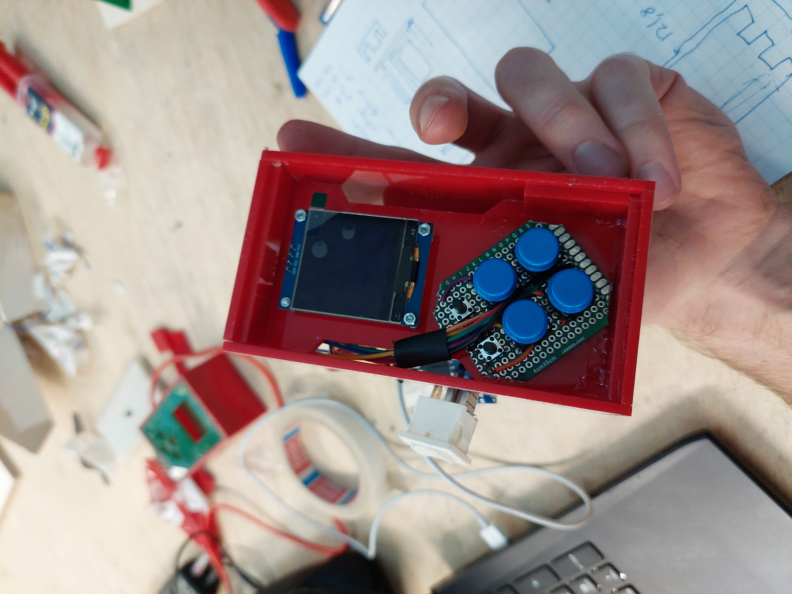
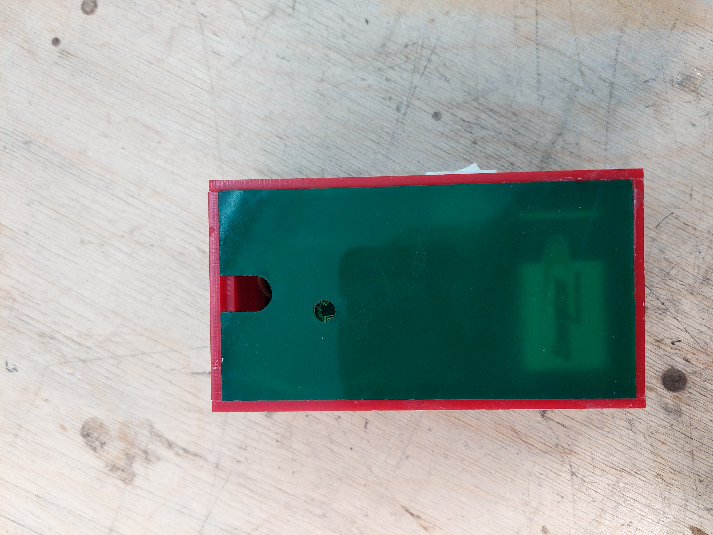

## Ryhmätyö Elektroniikan Perusteet 2 -kurssille

Tekijät:

- Oskari Ekholm

- Teemu Hiltunen

- Mikko Jutila

Aloitus:

24.02.2025

Valmis:

01.04.2025

### Kuvaus

Ideana luoda yksinkertainen pelikonsoli Arduino Nanoa (ATMega 328p) hyödyntäen. Peliksi valittiin klassinen käärmepeli tai matopeli, missä pelaaja kerää hedelmiä ja siten kasvattaa pituutta. Peliin lisättiin myös kivi, johon törmäämällä peli päättyy. Pelaaja voi myös halutessaan lisätä haastetta peliin vaihtamalla vaikeusasteen vaikealle, jolloin liikkumisnappien järjestys arvotaan.

Projektiin kuului myös kotelointi, ja päätimme valmistaa kotelon laserleikkaamalla, koska näin prototyyppiä tehdessä uusi iteraatio on nopea valmistaa.

Oheisessa kuvassa näkyy kotelon eri osat räjäytettynä tasolle, joka helpottaa hahmottamaan kuinka laatikko muodostuu. 
Laatikko valmistettiin J. Hyneman Centerillä LUT:illa ja siihen käytettiin Bodor BCL-1309XU laserleikkuria.

Ei aivan kohdallaan:

Toimiva:

Hahmottelua:

Sisältö:

Lopputulos:

